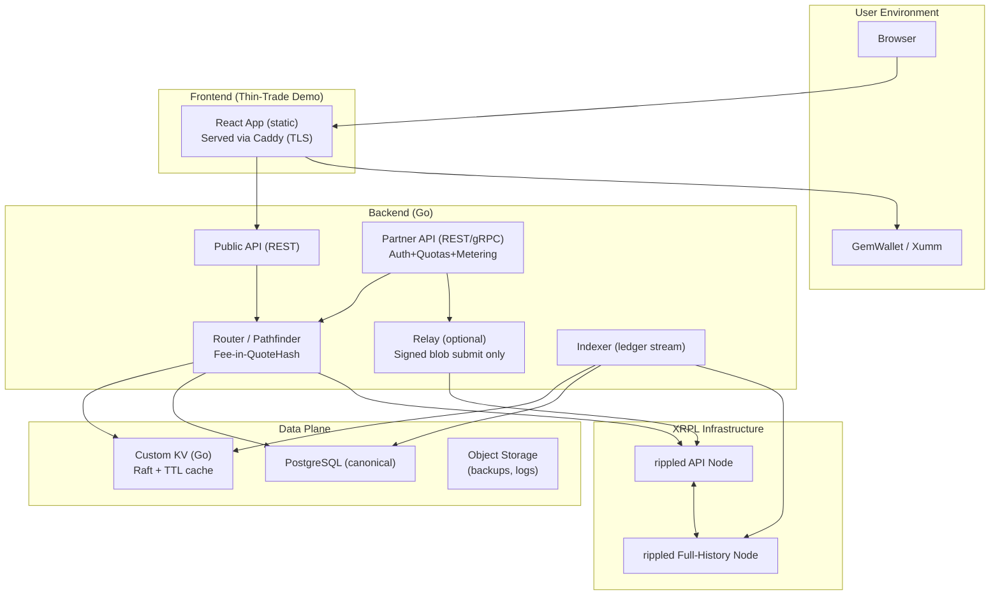

## Architecture & Build Plan (Neutral-Infra Patch v1)

Below updates adapt the previously drafted architecture to Lucendex's **neutral infrastructure + thin-trade bootstrap UI** strategy. Copy/paste this into your architecture section.

---

### A. Core Changes vs. Original Draft

1. **Relay is optional by default**

   * Default flow: wallet signs **and submits directly** to `rippled`.
   * Relay exists only as a convenience forwarder for **signed blobs**. No keys, ever.
   * Config: `RELAY_ENABLED=false` by default.

2. **Partner API front door (auth + quotas + metering)**

   * Add `/partner/*` endpoints gated by API-key + request signing (Ed25519) and optional mTLS for premium.
   * Per-partner rate limits in KV.
   * Usage metering to a minimal `usage_events` table for billing and SLOs.

3. **Public vs Partner surfaces**

   * `/public/*` = low-risk read + demo trade quote.
   * `/partner/*` = authenticated, higher limits, SLA-grade.

4. **Deterministic fee injection**

   * Router adds a small **routing fee (bps)**; included in the quote and the **QuoteHash** so it's tamper-evident.

5. **UI remains thin‑trade demo**

   * No LP UI, no listings admin, no charts in V1.
   * Prominent label: *"Demo client — production partners use the Partner API"*.

---

### B. Updated Component Diagram (Mermaid)



---

### C. Partner API: Auth, Quotas, Metering

**Auth headers (Ed25519 request signing):**

```
X-Partner-Id: <uuid>
X-Request-Id: <uuid>
X-Timestamp: <RFC3339>
X-Signature: base64(Ed25519(sign(canonical_request)))
```

* Canonical request = method + path + query + body SHA256 + timestamp.
* Optional mTLS for premium plans.

**Quota keys in KV (examples):**

```
rl:partner:{id}:{bucket} -> counter (TTL window)
partner:plan:{id}        -> cached plan info (TTL)
quote:{hash}             -> serialized route (TTL)
```

**DB additions:**

```sql
CREATE TABLE partners(
  id UUID PRIMARY KEY,
  name TEXT NOT NULL,
  plan TEXT NOT NULL,         -- free, pro, enterprise
  status TEXT NOT NULL,       -- active, suspended
  created_at TIMESTAMPTZ NOT NULL DEFAULT now()
);

CREATE TABLE api_keys(
  id UUID PRIMARY KEY,
  partner_id UUID REFERENCES partners(id),
  public_key TEXT NOT NULL,   -- Ed25519
  label TEXT,
  created_at TIMESTAMPTZ NOT NULL DEFAULT now(),
  revoked BOOLEAN DEFAULT FALSE
);

CREATE TABLE usage_events(
  id BIGSERIAL PRIMARY KEY,
  partner_id UUID REFERENCES partners(id),
  ts TIMESTAMPTZ NOT NULL DEFAULT now(),
  kind TEXT NOT NULL,         -- quote, submit, orderbook, route
  units INT NOT NULL,
  route_bps NUMERIC,
  meta JSONB
);
```

---

### D. API Surfaces (delta)

**Public**

* `GET /public/v1/pairs`
* `GET /public/v1/orderbook?base=XRP&quote=USD.rXYZ...`
* `POST /public/v1/quote` → `QuoteResp`

**Partner (auth required)**

* `POST /partner/v1/quote` → `QuoteResp` (higher limits, SLA)
* `POST /partner/v1/submit` → `{ tx_hash }` (signed blob only)
* `GET  /partner/v1/usage` → usage metering summary
* `GET  /partner/v1/health` → indexer freshness, router cache age, rippled lag

**Quote struct (with fee):**

```go
type Fees struct {
    RouterBps int
    EstOutFee Decimal
}

type QuoteResp struct {
    Route       Route
    Out         Decimal
    Price       Decimal
    Fees        Fees
    LedgerIndex uint32
    QuoteHash   [32]byte
    TTLLedgers  uint16
}
```

* `HashQuote` must include `Fees` fields in the canonical hash input.

---

### E. Security & Ops Additions

* Relay off by default; direct wallet submit is the recommended path.
* Per-partner SLO metrics (Prometheus labels by `partner_id`).
* Synthetic canary checks (quote + verify) every minute per critical market.
* Geofencing hook at API edge; no PII in logs, only `partner_id` for metering.
* Separate ingress: `api.lucendex.com` (partner) vs `demo.lucendex.com` (public).

---

### F. Revised Milestones (focused)

* **M0:** rippled node + indexer streaming (no UI yet)
* **M1:** DB schema + router quoting + deterministic fees
* **M2:** Public endpoints + thin‑trade demo (wallet sign & direct submit)
* **M3:** Partner API (auth, quotas, metering, SLOs); relay optional-only
* **M4:** 2 pilot integrations (wallet + fund); polish ops
