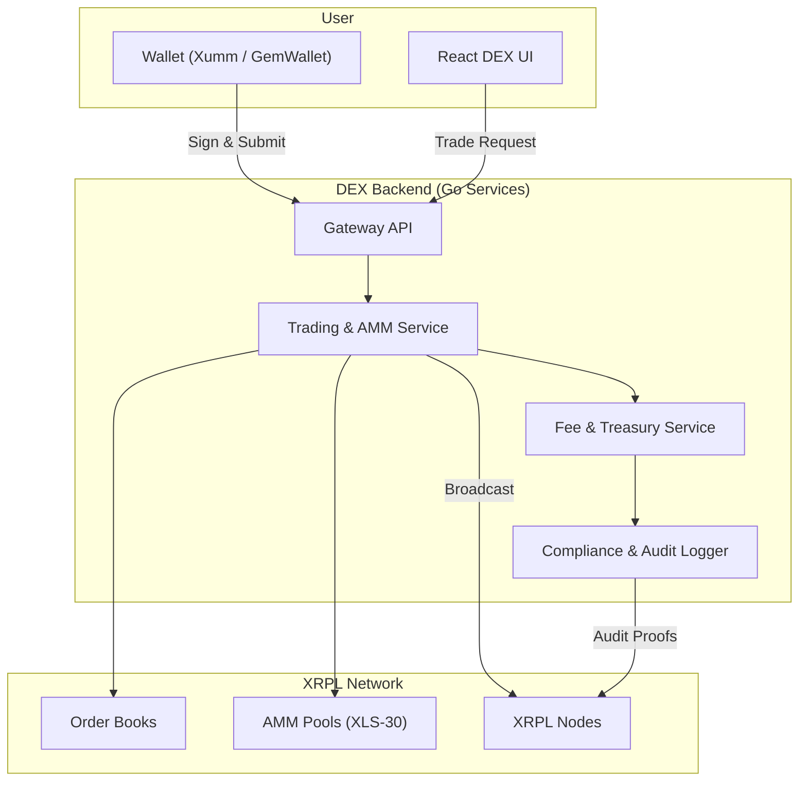

# 🧭 Compliance & Financial Flow — XRPL DEX Architecture

**Version:** 1.0
**Scope:** Defines compliance and financial flows for a **global, crypto-only XRPL DEX**, ensuring fully non-custodial, regulation-ready operation.
**Status:** Pre-build scope document.

---

## 1. Objectives

* Operate globally as a **crypto-only**, non-custodial DEX.
* Facilitate **trust-minimized swaps** between supported XRPL pairs (no fiat, no custody).
* Maintain **modular compliance readiness** for future regulation.
* Create **immutable, auditable trails** for all on-chain events.

---

## 2. Core Flow Diagram

---

## 3. User → DEX → XRPL Lifecycle

| Stage | Actor       | Description                               | Compliance Notes               |
| ----- | ----------- | ----------------------------------------- | ------------------------------ |
| 1     | User        | Connect wallet (Xumm/GemWallet)           | No personal data stored        |
| 2     | DEX UI      | Quote price via on-chain order book / AMM | Public XRPL data only          |
| 3     | Backend     | Compute swap + fee schedule               | Logged immutably               |
| 4     | User        | Sign transaction locally                  | No custody; user holds keys    |
| 5     | XRPL        | Broadcast & settle                        | Finality via XRPL consensus    |
| 6     | DEX Backend | Record TX + fee metadata                  | Stored for audit, not identity |

---

## 4. Compliance Design

### 4.1 Global Crypto-Only Policy

* No fiat ramps, no custody, no off-chain fund management.
* DEX acts as **router + indexer**, not an intermediary.
* Optional compliance mode (KYC hooks) for future regional requirements.

### 4.2 Minimal-Data Model

* Store only: hashed user wallet IDs, transaction hashes, fees, and timestamps.
* Never store: user IPs, IDs, or personal info.
* Each interaction signed and verified cryptographically.

### 4.3 Immutable Audit

* Fee and transaction logs written to append-only database.
* Daily signed export to object storage (S3/IPFS).
* Hash anchors can be published to XRPL for integrity proofs.

---

## 5. Financial Flow & Fee Structure

| Type              | Description        | Fee Asset | Destination              |
| ----------------- | ------------------ | --------- | ------------------------ |
| **Swap Fee**      | % on executed swap | XRP       | On-chain treasury wallet |
| **Liquidity Fee** | % from AMM exit    | XRP       | AMM pool treasury        |
| **Network Fee**   | XRPL native        | XRP       | Paid directly on-chain   |

**Fee Mechanics:**

* Deterministic per market (bps level).
* Fee recorded in Postgres with correlation ID + TX hash.
* Daily reconciliation between XRPL explorer and internal fee ledger.

**Treasury Wallet:**

* XRPL multi-sig (3-of-5) with hardware key management.
* No direct user deposits or withdrawals.

---

## 6. Audit Artifacts

| Artifact              | Description               | Retention |
| --------------------- | ------------------------- | --------- |
| **Trade Record**      | XRPL TX + metadata        | Permanent |
| **Fee Ledger Export** | Daily immutable log       | 7 years   |
| **System Snapshot**   | Proof of total fee volume | Monthly   |
| **Audit Hash**        | SHA-256 anchor on XRPL    | Permanent |

---

## 7. Initial Supported Pairs

**Selection Criteria:** liquidity, XRPL integration maturity, cross-market stability.

| Pair                                        | Description          | Rationale                    |
| ------------------------------------------- | -------------------- | ---------------------------- |
| **XRP / USD-backed stablecoin (USDC/XUSD)** | Core swap pair       | Anchor for all other markets |
| **XRP / BTC (wrapped)**                     | Major crypto pairing | High user demand             |
| **XRP / ETH (wrapped)**                     | Key DeFi pair        | Strong liquidity source      |
| **XRP / SOLO**                              | XRPL ecosystem token | Community-driven liquidity   |
| **XRP / ELS**                               | Example local token  | Showcase multi-token support |

> Phase 1: Focus on XRP ↔ major wrapped assets (BTC, ETH, USDC).
> Phase 2: Expand to ecosystem tokens (SOLO, ELS, CSC, etc.) once liquidity pools stabilize.

---

## 8. Monitoring & Transparency

* **Public Fee Dashboard:** real-time XRP fee flows per market.
* **Audit Feed:** daily JSON feed of TX hashes + collected fees.
* **Node Health Metrics:** uptime, XRPL latency, and consensus tracking.

---

## 9. Guiding Principles

1. **Crypto-native:** no fiat, no intermediaries.
2. **User-sovereign:** keys and custody remain with the user.
3. **Transparency-first:** all fees and audits publicly verifiable.
4. **Compliance-ready:** KYC/AML hooks built in, off by default.
5. **Global reach:** jurisdiction-neutral operations.

---

## 10. Next Steps

1. Finalize supported token list and verify XRPL liquidity depth.
2. Define fee bps and treasury wallet structure.
3. Implement fee ledger schema + audit exporter.
4. Draft compliance terms (crypto-only, non-custodial).
5. Align with security hardening document before sprint planning.

---

**Outcome:**
This document sets the compliance and financial structure for a **global, crypto-only XRPL DEX**, with fully non-custodial operation, transparent fee mechanics, and audit-ready design.  It forms part of the pre-sprint planning scope and system feasibility package.
