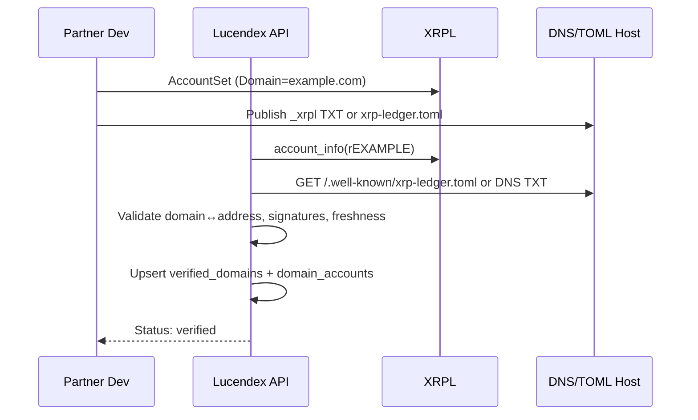

# External Wallet Interaction & Signed Domains

This document specifies how mobile, web/extension, and hardware wallets interact with Lucendex, and how we leverage **XRPL signed domains** (domain verification) to bind a **web domain ↔ XRPL account address** for trust, allowlisting, and UX.

---

## 1) Goals & Principles

* **Key-custody neutral:** Lucendex never handles private keys. Wallets sign.
* **Direct submit first:** Prefer wallet → rippled submit; Relay is optional.
* **Deterministic quotes:** Fees embedded in `QuoteHash` to prevent tampering.
* **Zero-trust edges:** All `partner/*` calls are authenticated and metered.
* **Verifiable identity:** Use XRPL **Account Domain** + domain proofs to tie a partner’s domain to their XRPL sending/fee-collection accounts.

=> https://xrpl.org/docs/concepts/tokens/decentralized-exchange/permissioned-domains#permissioned-domains

---

## 2) Wallet Capability Matrix

| Wallet Type                         | Connect                        | Sign | Submit                           | Return Path             | Notes                       |
| ----------------------------------- | ------------------------------ | ---- | -------------------------------- | ----------------------- | --------------------------- |
| Browser extension (e.g., GemWallet) | In-page provider               | Yes  | Direct to rippled or via Relay   | Promise/Callback        | Detect via injected API     |
| Mobile app wallet                   | Deep-link / universal link     | Yes  | Usually direct submit            | App callback / redirect | Stateless bridge via links  |
| Hardware wallet (USB/HID)           | WebHID/WebUSB/Bridge           | Yes  | Usually via host submit or Relay | Host process            | Show human-readable summary |
| Custodial/Server signer             | mTLS + Ed25519 request signing | Yes  | Direct or via Relay              | Sync webhook            | Requires allowlisting       |

---

## 3) High-Level Interaction Flows

### 3.1 Quote → Prepare → Sign → Submit (canonical)

1. **Quote**: `POST /public|partner/v1/quote` → `QuoteResp { Route, Out, Fees, LedgerIndex, QuoteHash, TTLLedgers }`.
2. **Prepare unsigned tx**: `POST /partner/v1/prepare` → `{ unsigned_tx, canonical_bytes, sign_hash, ttl_ledgers }`.
3. **Sign**: Wallet signs `canonical_bytes` → `signed_blob`, `tx_hash`.
4. **Submit**: Wallet submits directly to `rippled` **or** `POST /partner/v1/submit { signed_blob, quote_hash }` (Relay forwards).
5. **Confirm**: Indexer observes ledger acceptance → emits `usage_event` and audit record (stores `tx_hash`, `quote_hash`).

### 3.2 Mobile Deep-Link (non-persistent session)

* Browser → `wallet://sign?payload=<b64>&callback=https://demo.lucendex.com/cb/<nonce>`.
* Wallet returns to callback URL with `signed_blob` or performs direct submit and returns `tx_hash`.

### 3.3 Hardware Wallet

* UI shows canonical summary (amount, currency/issuer, destination, fee, TTL).
* Use WebHID/WebUSB to send `canonical_bytes` for signing.
* Submit via direct rippled RPC or Relay.

---

## 4) API Surfaces (delta for wallet flows)

**Public**

* `GET /public/v1/pairs`
* `GET /public/v1/orderbook` (read)
* `POST /public/v1/quote` → `QuoteResp`

**Partner (auth required)**

* `POST /partner/v1/prepare` → `{ unsigned_tx, canonical_bytes, sign_hash, ttl_ledgers }`
* `POST /partner/v1/submit` → `{ tx_hash }`
* `GET /partner/v1/health` → ledger freshness + validator participation

**Headers (partner auth):**

```
X-Partner-Id: <uuid>
X-Request-Id: <uuid>
X-Timestamp: <RFC3339>
X-Signature: base64(Ed25519(sign(canonical_request)))
```

---

## 5) Leveraging XRPL Signed Domains

### 5.1 What is a “signed domain” in XRPL?

* XRPL accounts can set the **`Domain`** field (hex-encoded ASCII) on-ledger via `AccountSet`.
* The referenced domain can publish **proofs** (e.g., DNS TXT or `xrp-ledger.toml`) that assert control of specific XRPL addresses.
* Lucendex can verify that a **domain ↔ account** binding exists and is valid.

### 5.2 Why we use it

* **Partner allowlisting**: Only allow fee collection / payouts to accounts bound to a verified partner domain.
* **Phishing resistance**: UI shows a ✅ badge like `example.com ↔ rEXAMPLE...` if the binding is valid.
* **API policy**: Higher rate limits or features when the caller’s `partner_id` domain matches its on-ledger account domain.

### 5.3 Verification Strategies (use one or more)

**A. On-ledger `AccountSet.Domain` check**

* Read `account_info` for `r...` → decode `Domain` (hex → ASCII). If it equals `example.com`, mark as **domain-claimed**.
* Optional: require HTTPS availability + TLS cert normal sanity checks.

**B. DNS TXT proof**

* Query `_xrpl.example.com` TXT or root TXT: include entries enumerating XRPL classic addresses and optional signatures.
* Example TXT record:

  ```
  _xrpl.example.com TXT "address=rEXAMPLE123; sig=MEUCIQD...; ts=2025-10-20"
  ```

  * `sig` is a signature of `address|domain|ts` using the **account’s pubkey**; Lucendex verifies it off-ledger.

**C. `xrp-ledger.toml` file**

* Host at `https://example.com/.well-known/xrp-ledger.toml`.
* Include sections like:

  ```toml
  [[ACCOUNTS]]
  address = "rEXAMPLE123"
  network = "main"
  domain  = "example.com"
  ```
* Lucendex fetches, parses, and validates freshness + matching.

**Recommendation**: Accept **any two** of the above (A + B or A + C) for **strong verification**, or **A** alone for **basic verification**.

### 5.4 Enrollment & Cache

* **Partner enrollment**: During onboarding, partner declares `domain` and primary `r...` accounts.
* Lucendex performs checks (A/B/C), stores results in `verified_domains` table, and caches (TTL 24h) in KV.
* Re-verify on a schedule and on-demand when accounts change.

**Schema**

```sql
CREATE TABLE verified_domains (
  domain TEXT PRIMARY KEY,
  status TEXT NOT NULL,              -- pending, verified, revoked
  last_checked TIMESTAMPTZ NOT NULL,
  details JSONB                      -- methods used, accounts list, proofs
);

CREATE TABLE domain_accounts (
  domain TEXT NOT NULL,
  address TEXT NOT NULL,
  verified_by TEXT[],                -- ["on_ledger_domain","dns_txt","toml"]
  PRIMARY KEY (domain, address)
);
```

---

## 6) Runtime Policy Hooks Using Signed Domains

* **Outbound payments / fee collection**: Block if destination address lacks verification link to the partner’s configured domain.
* **Quote limits**: Increase per-route limits if the route’s issuer accounts are domain-verified.
* **UI badge**: Show `example.com` chip next to addresses in routes and confirmations.
* **API**: `GET /partner/v1/domain-status?domain=example.com` → `{ status, accounts[] }` for transparency.

---

## 7) Security Controls

* Enforce **`TTLLedgers`** and `LedgerIndex` windows; reject late submits.
* Verify `signed_blob` signature and recompute **`QuoteHash`** before forwarding.
* Rate-limit prepare/submit per `partner_id` and IP.
* **Address normalization**: Support classic addresses + destination tags; **avoid X-address** internally; always store classic+tag.
* **Phishing safeguards**: Never trust off-ledger proof alone; require on-ledger `Domain` for basic level.
* **Revocation**: If DNS/TOML proof changes or disappears, downgrade to `pending` and notify partner.

---

## 8) Developer UX (SDK tips)

* **JS SDK**: `verifyDomain(address)`, `fetchToml(domain)`, `parseTxt(domain)`, `checkOnLedgerDomain(address)`.
* **Mobile**: deep-link helper `buildWalletLink(payload, callbackUrl)`.
* **Server**: reference code to validate DNS/TOML and cache results in KV.

---

## 9) Example: Domain Verification Flow (pseudo)



---

## 10) UX Copy Snippets

* **Verified**: "Sending to **rEXAMPLE…** (verified: **example.com**)."
* **Unverified**: "This address isn’t linked to a domain. Proceed with caution."
* **Revoked**: "Verification for **example.com** changed recently. Limits temporarily reduced."

---

## 11) Open Questions / Options

* Cache TTL policy (24h vs. 6h) and backoff on DNS/TOML errors.
* Require dual verification (on-ledger + off-ledger) for fee-collecting accounts?
* Add webhook so partners can notify us to re-scan when they rotate accounts.

---

## 12) Milestones

* **M0**: Implement on-ledger Domain check + UI badges.
* **M1**: Add DNS/TOML verification and caching + `/domain-status` endpoint.
* **M2**: Enforce allowlisting for partner payout/fee addresses.
* **M3**: SDK helpers for verification + example integrations.
